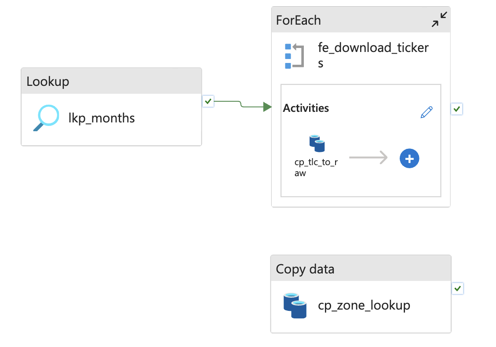

# 🚕 NYC Taxi Medallion Data Pipeline — Azure + Databricks

End-to-end cloud data engineering project: **~40 million NYC taxi trips** ingested from a public dataset with **Azure Data Factory** into an **ADLS Gen2** data lake, refined through a **Bronze → Silver → Gold Delta Lake medallion architecture** with **PySpark** on **Databricks**, and served through **SQL** and an **AI/BI dashboard**.


---

## At a glance

| | |
|---|---|
| **Source** | [NYC TLC Trip Record Data](https://www.nyc.gov/site/tlc/about/tlc-trip-record-data.page) — official open data, Parquet, served over CloudFront |
| **Volume** | 12 monthly files (2025), ~55 MB each → **~40M trip records** |
| **Ingestion** | Metadata-driven ADF pipeline: `Lookup → ForEach (8 parallel) → Copy` |
| **Storage** | ADLS Gen2, date-partitioned immutable raw zone |
| **Transformation** | PySpark on Databricks serverless → 7 Delta tables across 3 layers |
| **Serving** | Databricks SQL + AI/BI dashboard |

> Replace the placeholder counts below with your actual run numbers.

| Metric | Value |
|---|---|
| Rows ingested (bronze) | `~40,000,000` |
| Rows after cleaning (silver) | `~39,000,000` |
| Rows quarantined by DQ rules | `~1–3%` |
| Gold tables | 3 |
| Pipeline runtime (ingestion) | ~3 min |

---

## Architecture

```mermaid
flowchart LR
    subgraph SRC["🌐 Public source"]
        TLC["NYC TLC Trip Data<br/>CloudFront CDN<br/>1 Parquet / month"]
    end

    subgraph AZ["☁️ Azure"]
        ADF["Azure Data Factory<br/>metadata-driven pipeline<br/>Lookup → ForEach ×8 → Copy"]
        LAKE[("ADLS Gen2 — raw zone<br/>raw/tlc/yellow/month=YYYY-MM/")]
    end

    subgraph DBX["🧱 Databricks — Delta Lake"]
        VOL["Unity Catalog Volume<br/>(landing)"]
        B["🥉 BRONZE<br/>as-landed + lineage"]
        S["🥈 SILVER<br/>typed · validated · deduped<br/>MERGE upserts"]
        G["🥇 GOLD<br/>revenue · demand · flows"]
        Q["🚧 quarantine<br/>DQ rejects + reason"]
        SQL["SQL editor + dashboard"]
    end

    TLC -->|HTTP GET| ADF --> LAKE
    LAKE -->|"SAS token + Azure SDK"| VOL --> B --> S --> G --> SQL
    S -.->|rule violations| Q

    classDef src fill:#1f6f43,color:#fff,stroke:none
    classDef az fill:#0b5cab,color:#fff,stroke:none
    classDef dbx fill:#b3541e,color:#fff,stroke:none
    classDef warn fill:#8a6d1f,color:#fff,stroke:none
    class TLC src
    class ADF,LAKE az
    class VOL,B,S,G,SQL dbx
    class Q warn
```



---

## What this project demonstrates

- **Metadata-driven orchestration** — a JSON control file (`config/months.json`) drives the ingestion loop; adding a month is a config change, not a code change.
- **Data lake zone design** — immutable, date-partitioned raw zone (`month=YYYY-MM/`), binary copies so files land byte-for-byte as received.
- **Medallion architecture** — each layer has an explicit contract: bronze for replay, silver for truth, gold for consumption.
- **Data quality engineering** — 10 domain rules; rejects are **quarantined with the rule they violated**, never silently dropped, so DQ becomes a queryable metric.
- **Idempotency at every layer** — bronze `DELETE`+append per slice, silver `MERGE INTO` on a synthetic key, gold full recompute. Re-running never duplicates a row.
- **Surrogate key engineering** — TLC trips have no natural ID, so a SHA-256 hash of the identifying columns becomes the merge key.
- **PySpark feature engineering** — trip duration, average speed, tip percentage, temporal attributes derived once in silver.
- **Delta Lake internals** — ACID writes, `MERGE`, partitioning, `DESCRIBE HISTORY` / time travel.
- **Cloud-to-cloud integration** — scoped, expiring SAS credential (read + list only) bridging Azure storage to Databricks compute.

---

## Repository structure

```
.
├── adf/                                  # Azure Data Factory definitions (JSON, secrets removed)
│   ├── pipeline_pl_ingest_tlc_monthly.json
│   ├── dataset_ds_http_tlc_bin.json
│   ├── dataset_ds_adls_raw_bin.json
│   ├── dataset_ds_adls_months_config.json
│   ├── linkedService_ls_http_nyctlc.json
│   └── linkedService_ls_adls_datalake.json
├── config/
│   └── months.json                       # ingestion control file (the pipeline's worklist)
├── notebooks/                            # Databricks notebooks (exported source)
│   ├── 00_setup_lakehouse.py             # schemas + landing Volume
│   ├── 01_ingest_adls_to_volume.py       # ADLS → Volume via SAS + Azure SDK
│   ├── 02_bronze_load.py                 # raw Parquet → bronze Delta (+ lineage)
│   ├── 03_silver_transform.py            # types, DQ quarantine, dedupe, MERGE
│   └── 04_gold_aggregates.py             # business aggregates
├── sql/
│   └── *.sql
└── docs/
│    ├── note.html                    # full build walkthrough + incident log
│    └── img/
└── dashboard/
    └──  NYC_Taxi_Analytics_2025.pdf 

```

---

## 🥉🥈🥇 The data model

| Layer | Table | Grain | Contents |
|---|---|---|---|
| bronze | `tlc_bronze.trips_raw` | one row per source record | untouched source columns + `_source_file`, `_ingested_at`, `_service`; partitioned by `month` |
| bronze | `tlc_bronze.zone_lookup_raw` | one row per zone | 265-row dimension, all strings |
| silver | `tlc_silver.trips` | one row per `trip_id` | typed, validated, deduplicated + derived `duration_min`, `mph`, `tip_pct`, `pickup_hour`, `day_of_week` |
| silver | `tlc_silver.dim_zone` | one row per zone | conformed dimension: zone → borough, zone name, service zone |
| silver | `tlc_silver.trips_quarantine` | one row per rejected record | includes `_dq_rule` — *why* it was rejected |
| gold | `tlc_gold.daily_borough_revenue` | borough × day | trips, revenue, tips, averages, revenue per mile |
| gold | `tlc_gold.hourly_demand` | weekday × hour | demand curve, average fare, **average speed as a congestion index** |
| gold | `tlc_gold.zone_pair_flows` | origin × destination | top corridors (≥500 trips) with trip economics |

---

## The ingestion pipeline

`pl_ingest_tlc_monthly` — parameter `service_type` (default `yellow`, so green taxis are one parameter away).

| Activity | Type | Role |
|---|---|---|
| `lkp_months` | Lookup | reads `config/months.json` from the lake → array of months |
| `fe_download_months` | ForEach | iterates the array, `batchCount: 8` (parallel) |
| └ `cp_tlc_to_raw` | Copy | builds the source URL dynamically, GETs the Parquet, writes `raw/tlc/{service}/month={month}/`, retry ×2 |
| `cp_zone_lookup` | Copy | independent branch: fetches the zone dimension CSV |




---

## Data quality

Ten rules run in silver. Rows failing any rule are written to `trips_quarantine` tagged with every rule they broke:

| Rule | Catches |
|---|---|
| `null_timestamp` | missing pickup/dropoff time |
| `dropoff_not_after_pickup` | impossible ordering |
| `duration_over_12h` | meter left running |
| `non_positive_distance` / `distance_over_200mi` | broken odometer readings |
| `negative_total` / `total_over_5000` | refunds and fare-entry errors |
| `implausible_speed` | > 100 mph (GPS/meter errors) |
| `bad_passenger_count` | null or negative |
| `date_outside_2025` | stray timestamps from other decades |

```sql
SELECT _dq_rule, count(*) AS rows_quarantined
FROM workspace.tlc_silver.trips_quarantine
GROUP BY _dq_rule ORDER BY rows_quarantined DESC;
```

Most pipelines can't answer *"how much bad data did you have, and what kind?"* — this one answers it in one query.

---

## Sample insights

```sql
-- Demand and congestion by hour of day
SELECT pickup_hour, sum(trips) AS trips, round(avg(avg_mph), 1) AS avg_mph
FROM workspace.tlc_gold.hourly_demand
GROUP BY pickup_hour ORDER BY pickup_hour;
```

Findings from the gold layer:

- **Manhattan dominates** trip volume; airport zones drive the highest-value corridors.
- **Average speed inverts demand** — slowest in late-afternoon rush, fastest pre-dawn: a traffic-congestion index derived from taxi meters.
- **Tipping varies by borough and payment type**, visible directly in `daily_borough_revenue`.

[View Dashboard](dashboard/NYC_Taxi_Analytics_2025.pdf)

---

## Reproducing this project

**Prerequisites:** an Azure subscription (the free/student tier is enough) and a [Databricks Free Edition](https://www.databricks.com/learn/free-edition) account.

1. **Lake** — create a resource group and an ADLS Gen2 storage account (*hierarchical namespace enabled*), plus a `datalake` container. Upload `config/months.json` to `config/`.
2. **Factory** — create a Data Factory; add the linked services, datasets, and pipeline from `adf/` (paste each JSON into the corresponding object's code view). Set the storage credential in the ADLS linked service.
3. **Ingest** — run `pl_ingest_tlc_monthly` (Debug). Verify 12 monthly folders + the zone lookup in the raw zone.
4. **Lakehouse** — import `notebooks/` into Databricks, then run `00` → `04` in order. Notebook `01` needs a container SAS token (read + list) pasted into its widget.
5. **Analyze** — run `sql/gold_queries.sql` in the SQL editor and build a dashboard from the gold tables.

Detailed walkthrough with screenshots: [`docs/note.html`](docs/note.html).

---

## Production considerations

Deliberate free-tier compromises, and what would change in a production environment:

| Here | In production |
|---|---|
| SAS token → Volume → Spark (Free Edition is serverless-only) | Unity Catalog **external locations** reading `abfss://` in place, no data movement |
| Storage account key in the ADF linked service | ADF **managed identity** + `Storage Blob Data Contributor` role; secrets in Key Vault |
| Notebooks run manually in sequence | **Lakeflow Job** (or ADF Databricks activity) with dependencies, retries, and alerting |
| Gold rebuilt in full | Incremental MERGE or streaming tables once volume justifies it |
| DQ rules inline in PySpark | Declarative expectations (DLT / Great Expectations) with metric tracking over time |
| Static reference dimension | SCD Type 2 history on the zone dimension |


